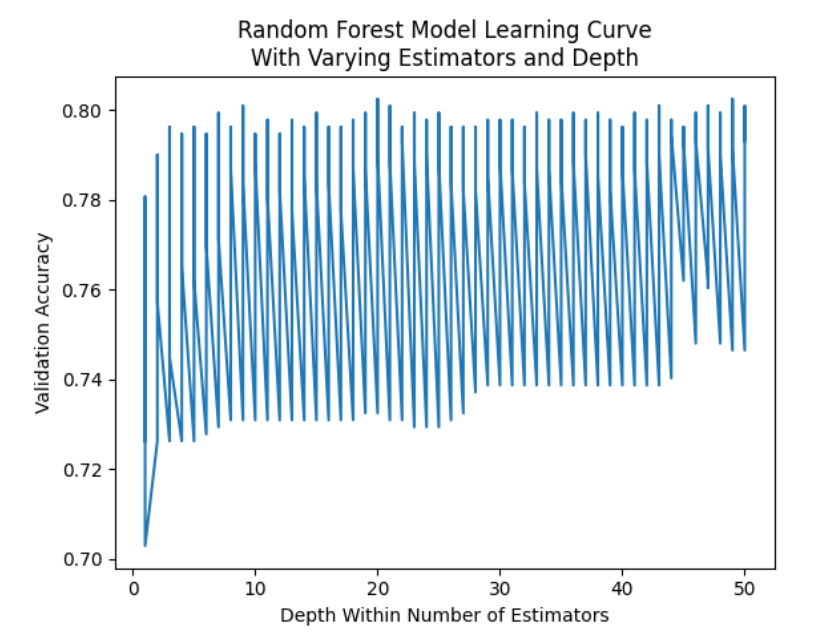
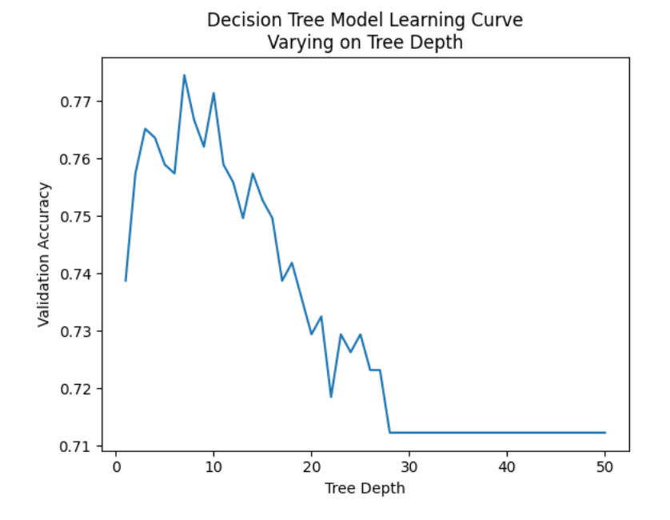

# Sprint 7 Project: Introduction to Machine Learning
 
---

### 📚 Table of Contents
- 🔍 [Project Overview](#project-overview)
- 📈 [Conclusion](#conclusion)
- 🖼️ [Sample Outputs](#sample-outputs)
- 📁 [Files](#files)

---

## Project Overview

Mobile carrier Megaline has found out that many of their subscribers use legacy plans. They want to develop a model that would analyze subscribers' behavior and recommend one of Megaline's newer plans: Smart or Ultra. 

You have access to behavior data about subscribers who have already switched to the new plans (from the project for the Statistical Data Analysis course). For this classification task, you need to develop a model that will pick the right plan. Since you’ve already performed the data preprocessing step, you can move straight to creating the model.  

Develop a model with the highest possible accuracy. In this project, the threshold for accuracy is 0.75. Check the accuracy using the test dataset.  

---

## Conclusion

The goal of this project was to recommend Megaline phone plans to subscribers with legacy plans based on their behavior. I trained and tested decision tree classifier, random forest classifier, and logistic regression models. The best model was a random forest classifier with 20 estimators and depth 15. It correctly classified 78% of Megaline plans in the test data set, better than the other models and far superior than would be expected by chance. That model should be satisfactory for the purpose of recommending plans to users.

---

## Sample Outputs

Here are two key moments from the analysis:

  
*Validation accuracy peaked at depth 7 (77.45%) — deeper trees began to overfit and performed worse on validation data.*

 

  
*The best random forest classifier achieved 80.25% validation accuracy with 20 estimators and a maximum depth of 15.*

---

## Files

📄 See the full analysis in [`sprint-07-project.ipynb`](./sprint-07-project.ipynb)  
📄 Or view a static version in [`sprint-07-project.html`](./sprint-07-project.html)  
📄 Project background: [`project-description.md`](./project-description.md)

> Note: This project uses one CSV file, which is included in the `/data/` folder.  
> See [`/data/README.md`](./data/README.md) for details.
